<div align="center">

# ⚔️ LiteCode

**中文** · [English](README.en.md)

**一台自己的机器,养一个全能 AI。** 网页上它是军师,终端里它是工程师,微信里它是随叫随到的助理——背后同一个大脑,聊到哪都接得上。模型用你自己的,数据不出家门,云厂商从你这儿一分钱都赚不走。

    

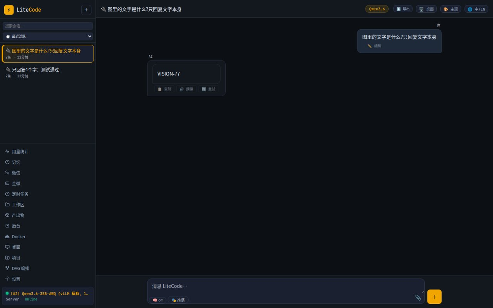

⭐ 觉得好用的话,顺手点个 star,就是对我们最大的支持。

</div>

---

## 一、怎么跑起来(照抄就行)

你需要:一台 Linux 机器(家里服务器、云主机、旧电脑都行)+ 装好 Docker。

**第 1 步:把代码下下来**

```bash
git clone https://github.com/wfcz10086/litecode && cd litecode
```

**第 2 步:告诉它你的模型在哪**

```bash
cp config.example.json config.json
```

然后打开 `config.json`,找到 `model` 那一段,填两个东西:

- `backend_url`:你的模型地址。自己搭的 vLLM、Ollama,或者买的中转 API 都行,只要是 OpenAI 格式的接口(就是地址长得像 `http://xxx:8000/v1` 那种)。
- `api_key`:模型的 key。自己搭的没设 key 就填 `EMPTY`。

没有模型?随便找个卖 OpenAI 兼容 API 的中转站,把地址和 key 填进来就能用。

**第 3 步:启动**

```bash
./start.sh
```

第一次会自动构建镜像,慢一点,等它跑完。之后再启动就是几秒钟的事。

**第 4 步:打开浏览器**

访问 `http://你机器的IP:18790`,看到登录页就成功了。

---

## 二、怎么登录

一共就三个地方要认证,都很简单:

| 在哪 | 怎么进 | 密码在哪改 |
|---|---|---|
| **网页**(:18790) | 输一个密码 | `config.json` 里的 `web_ui.auth.password`,把 `CHANGE_ME_PASSWORD` 改成你自己的 |
| **API**(:18789) | 请求头带 `Authorization: Bearer 你的token` | `config.json` 里的 `server.token`,把 `CHANGE_ME_TOKEN` 改成你自己的 |
| **命令行** | 先 `litecli login` 输一次密码,之后就不用管了 | 跟网页共用一个密码 |

没有注册、没有多账号那套复杂东西。这是你一个人的机器,一个密码、一个 token,完事。

> 提醒:启动前记得把上面两个 `CHANGE_ME` 改掉,别用默认值裸奔公网。

---

## 三、它能帮你干什么

**干活的一面:**

- 🗣️ 你说"扫描这个项目,写份架构报告" → 它自己拆成流水线(shell 节点扫描 → 分析节点归纳 → 写作节点出报告),跑完每一步的记录都留着,哪步出的结果都能翻。
- 📄 微信里丢个 PDF / 一段语音 / 一张截图给它 → 文件它解析、语音它转文字、图它用视觉模型看,回你的是处理完的结果,不是"我收到了一个文件"。
- ⏰ "每天早上 9 点查一下 BTC,给我发份简报到企微" → 一句话建好定时任务,第二天开始准时推送,执行历史一条条可查。
- ⌨️ 终端里一句话,它写文件、给你看 diff(加了哪几行红绿分明)、跑命令、验证结果,最后报一句这轮花了多少 token。
- 🖥️ "打开浏览器搜一下这个报错" → 它真的在远程桌面里开浏览器、点进去、截图发回来。你在 noVNC 里全程围观。
- 📊 "帮我把这份数据分析一下出个图" / "把这几页写成 PPT" → 数据分析、画图、Word / Excel / PPT / PDF 生成,全是现成技能。

**陪你的一面(这个别家真没有):**

- 💞 **陪伴模式**:深夜你说"睡不着,有点 emo" —— 它不会回你"建议规律作息"。它会说"嗯,我在。想说什么都行"。这个模式里说教是被明令禁止的:不给方案、不灌鸡汤、短句慢聊,先接住情绪再说别的。情绪词会自动触发,你不用手动开。
- 🎭 **博弈推演模式**:你问"这个利好消息能信吗" —— 普通 AI 会复述新闻,它会先拆局:这消息谁放的?谁获利?对手盘是谁?关键变量是什么?正反两面各推一遍,最后才给判断。一键开关,看行情、读新闻、分析商业决策都好使。核心就一句话:**先问谁得利,再信是不是真的。**
- ✍️ **写小说是专业级的**:21 种题材(玄幻、修真、武侠、都市、诡异、科幻、言情、宫斗、系统流、无限流……)每种一个专门技能,长篇有大纲工程管着连贯性,写完还有一道"去 AI 味"审计工序,专治"一眼就是 AI 写的"。

---

## 四、截图

**DAG 流水线编辑器** —— 左边是可拖的节点面板(9 种 agent + 现成工具 + 决策分支 + 子流水线),拖出来连上线,点 Build 就跑:

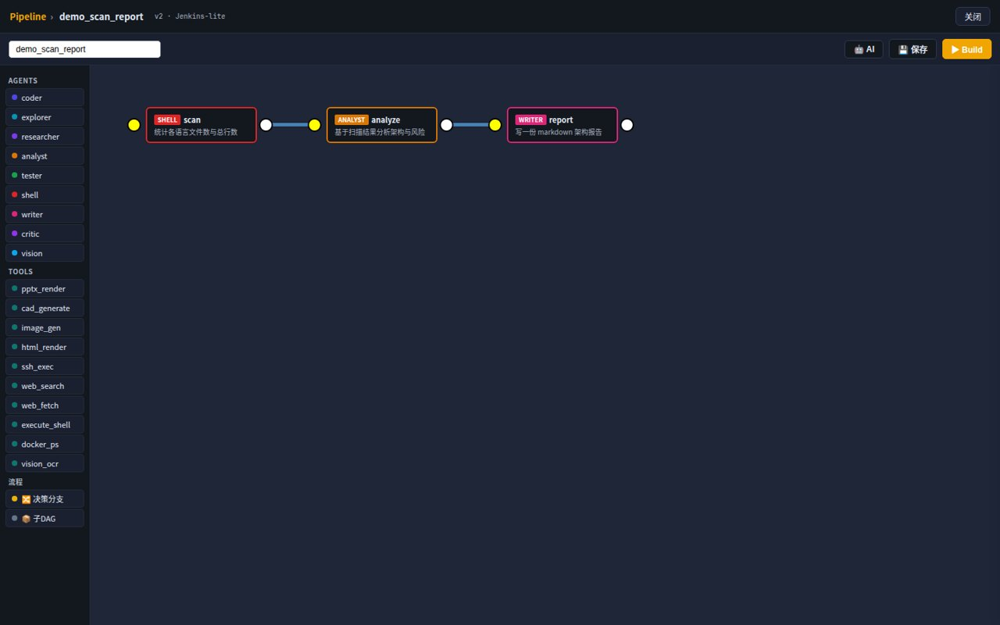

**命令行** —— 一句话进去,写文件、看 diff、跑命令、报 token,全流程可见:

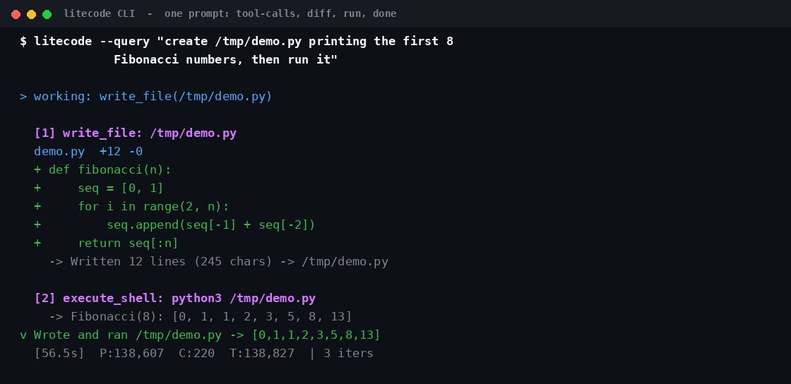

**微信接入** —— 扫码接入,视觉模型兜底配置,主模型看不了图时自动换它看:

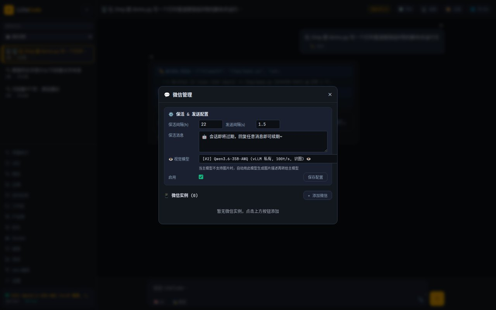

<table>
<tr>
<td align="center" width="50%"><b>🤖 企业微信机器人,真流式回复</b><br>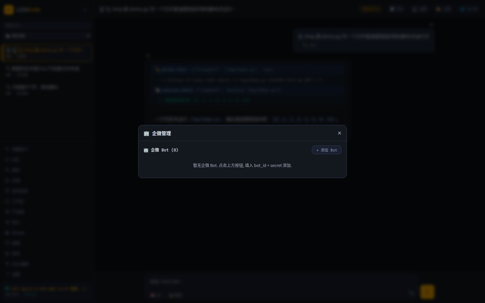</td>
<td align="center" width="50%"><b>🧠 记忆面板,聊过的它都记得</b><br>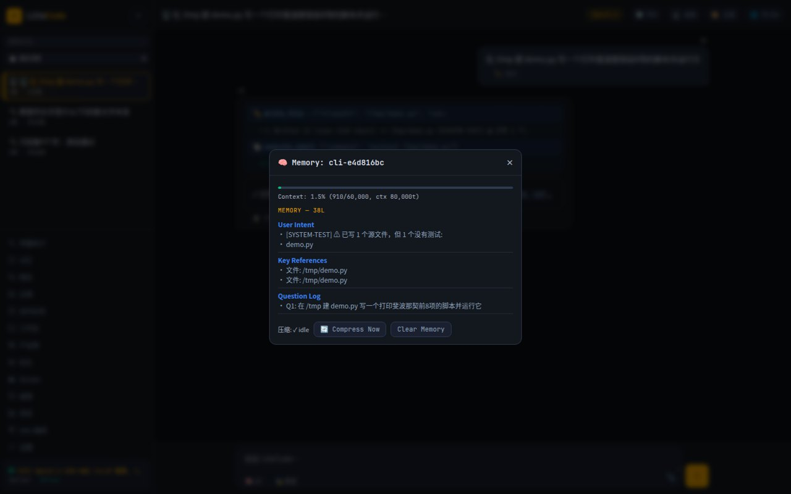</td>
</tr>
<tr>
<td align="center"><b>🔌 模型管理,随时热切换</b><br>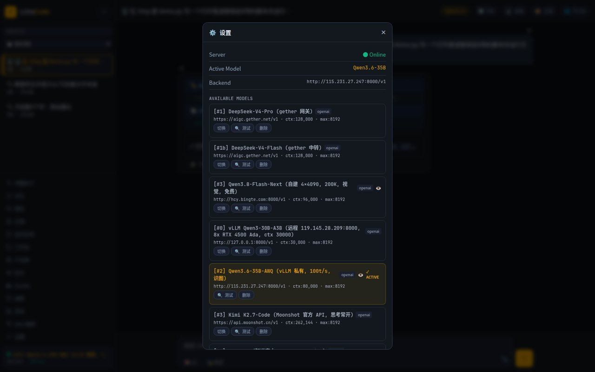</td>
<td align="center"><b>⏰ 定时任务 + 执行历史</b><br>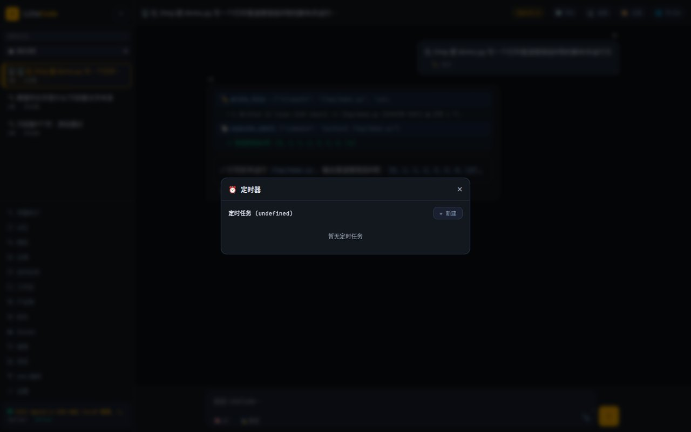</td>
</tr>
<tr>
<td align="center"><b>📊 用量和成本,花了多少一目了然</b><br>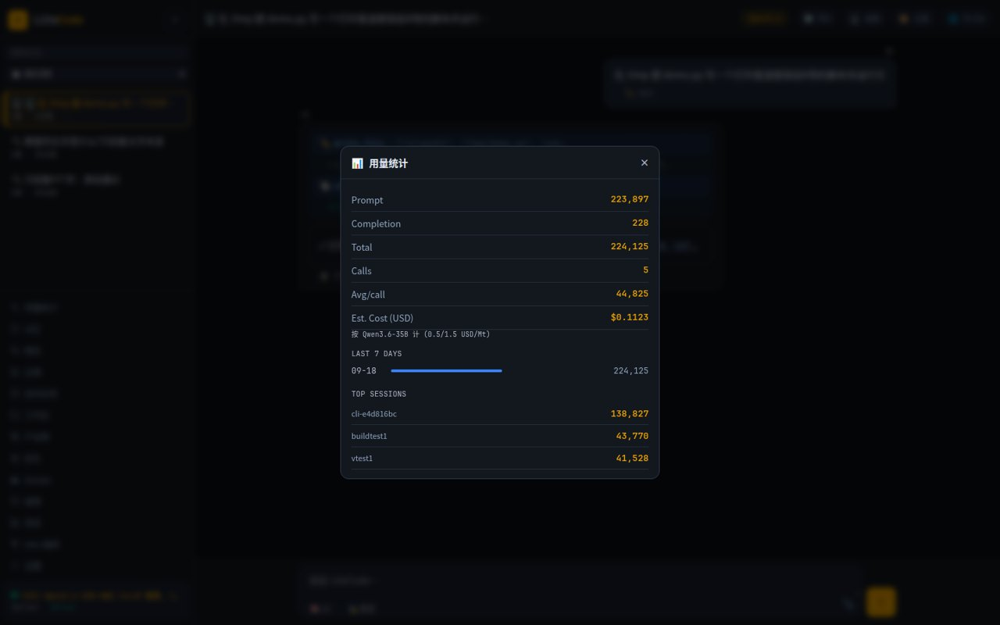</td>
<td align="center"><b>🐳 聊天里就能管 Docker</b><br>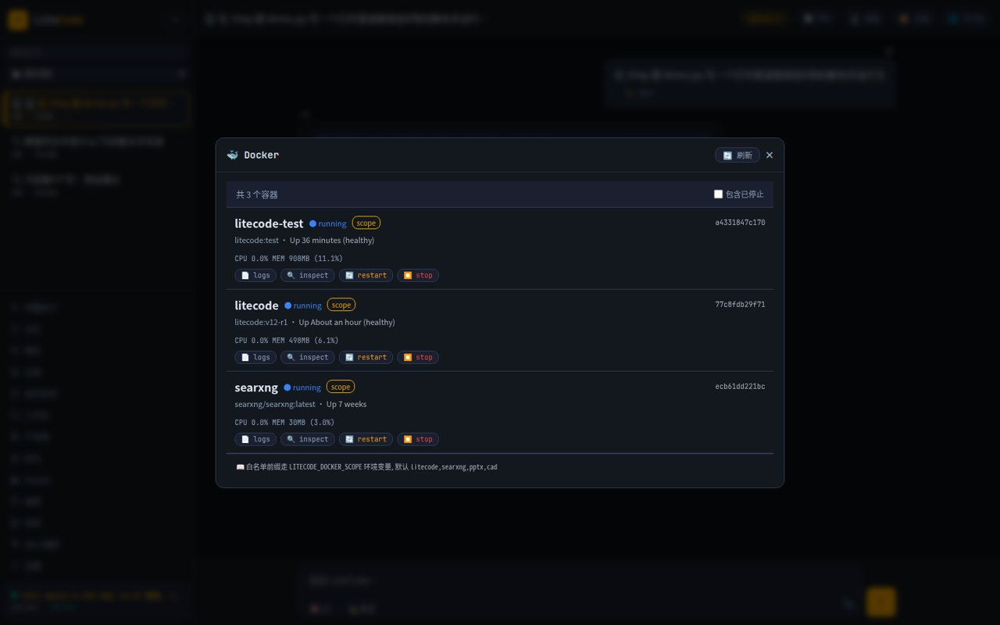</td>
</tr>
<tr>
<td align="center"><b>📦 产出物仓库</b><br>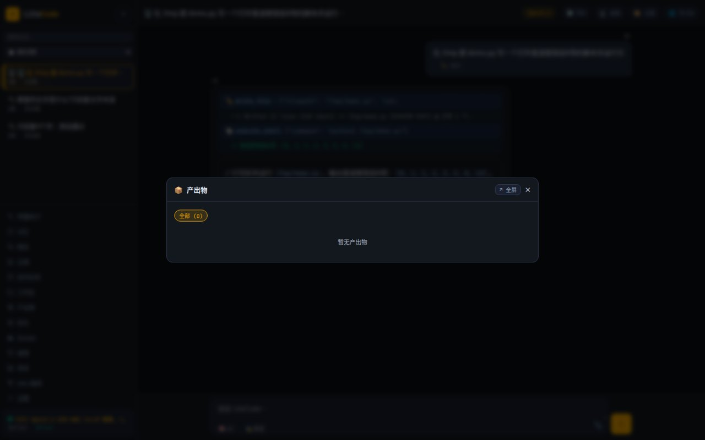</td>
<td align="center"><b>⌨️ CLI 全部命令</b><br>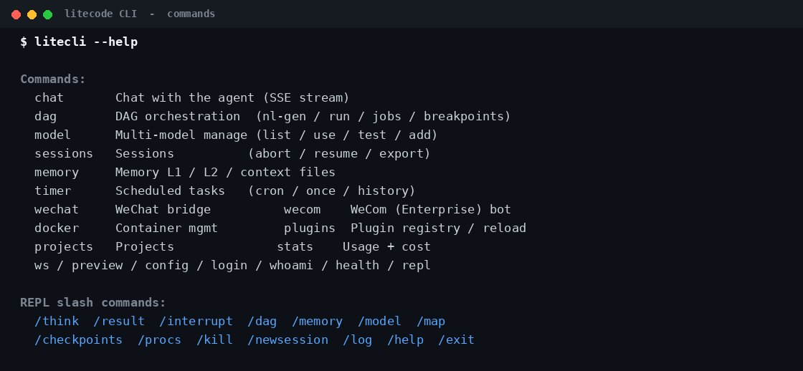</td>
</tr>
</table>

---

## 五、凭什么值得一个 star

### 数字打底

| 72 | 92 | 9 | 14 | 5 | 4 | 3 | 1 |
|:---:|:---:|:---:|:---:|:---:|:---:|:---:|:---:|
| 个工具 | 项技能 | 种 agent | 个搜索引擎 | 种模型后端 | 级记忆 | 个入口 | 个容器 |

下面每一条都不是概念,是能在代码里指出具体位置的实现。

### 🧠 记忆:不是"存聊天记录",是一套分层压缩系统

- **四层结构**:L0 滑动窗口(近期原文)→ L1 常驻档案(每轮都在,永不被裁)→ L2 分类笔记(偏好/项目/反馈分文件)→ L3 SQLite 全文索引(跨会话检索,新会话自动带上)。
- **压缩时机不靠猜**:上下文预算用**上游返回的真实 token 数**校准,而不是按字数瞎估——中文场景下字数估算能偏差 30% 以上,这就是很多 agent "明明还有空间却断片"或"以为有空间结果爆掉"的原因。
- **写入不靠模型自觉**:你说"以后回答用中文",规则引擎直接捕获落盘,顺手把密钥、密码脱敏。不指望模型"记得调存档工具"。
- **崩溃不丢**:会话有 WAL 日志,进程崩了重放恢复;大任务前自动打快照,做砸了能回滚。

### 🏗️ 流水线:抄的是 Jenkins 的作业,不是玩具

- 节点类型齐:9 种 agent、原生工具步、**子流水线嵌套**、**双出口决策节点**;步骤间有条件(`when`,多条件 AND/OR)和取值传参(`${step:某步:json:字段}`)。
- 跑起来是工程级的:同层并行、失败自动带着上次的错误反思重跑、**按步骤内容哈希做 checkpoint**(同样的步骤重跑直接秒回缓存结果)、心跳监控、每步开始结束都进执行时间线,中断了能续。
- 这套不是自嗨:仓库里带一套 **27 项真浏览器回归**(playwright 模拟真人点击),每次改动跑一遍,绿了才算数。

### 🧩 插件:加能力 = 加一个文件,这是写进架构里的

- 契约就三样:名字、参数表、一个 `run` 函数。写好丢进 `plugins/tools/`,registry 启动自动扫描,还能热重载。产物(图片/文件)有统一的落盘通道,前端自动渲染。
- 生图已内置四个后端(DALL·E / SD-WebUI / ComfyUI / mock)。视频、音乐生成照这个骨架抄一个文件就接上,**核心代码一行不用动**。
- 外部整项目(比如 PPT 渲染器)靠挂载 + 环境变量接入,零拷贝,拔了环境变量就干净卸载。

### 🔍 搜索:四层兜底,还真读正文

免费 API → 本机 SearXNG 聚合(私有 JSON 网关,不吃验证码)→ 14 引擎并行爬 HTML → 真浏览器兜底。`deep_search` 拿到结果后会**点进去把正文读了**再回答,引用密度有检查,不是拿标题糊弄。

### 📱 三端一个大脑,协议是冻结的

网页、命令行、微信/企微连的是同一个 agent 循环、同一份记忆。SSE 字段有冻结契约文档,新字段只加不改——所以微信里聊到一半,回网页能接上,不是三个各自为政的机器人。

### 🔎 干了什么全程可查

每轮迭代、每次工具调用、每步流水线都进 trace;静默失败会被显式暴露;连"系统往提示词里注入了几次守卫"都有计数。出了问题不用猜,翻记录就行。

---

## 六、跟同类比一下

| | **LiteCode** | Dify | LangChain | Open WebUI |
|---|:---:|:---:|:---:|:---:|
| 单容器自托管 | ✅ | ✅ | 是个库 | ✅ |
| OpenAI 兼容网关 | ✅ | 部分 | — | 仅对话 |
| 网页 + 命令行 + 聊天机器人同一个大脑 | ✅ | 仅网页 | 写代码 | 仅网页 |
| 内置微信 / 企业微信机器人 | ✅ | — | — | — |
| 可视化 DAG 流水线(断点/续跑/checkpoint) | ✅ | flow | 写代码 | — |
| 生图 / 视频 / 音乐插件位 | ✅ | 工具 | 工具 | — |
| 对话操控桌面 | ✅ | — | — | — |
| 四级持久记忆 + 崩溃恢复 | ✅ | 部分 | — | 基础 |
| 陪伴 / 博弈推演这类"性格"模式 | ✅ | — | — | — |

_不是打分表,人家各有各的强项。LiteCode 赌的是:一台自己的机器,全都要。_

### 🔗 给你手里的 AI 工具集体开挂

网关就是标准 OpenAI 接口。翻译插件、ChatBox、Dify、LangChain……你现在用的随便哪个客户端,把地址改成 `http://你的机器:18789/v1`——背后的模型瞬间学会调工具、查资料、记住你,外加 92 项技能。**改一行地址,全家免费开挂。** `user` 字段传个固定值,它连你上次聊什么都记得。

---

## 七、架构(一张图)

```
   微信 / 企微机器人 ┐
   命令行 CLI        ├──▶  网关 :18789  (OpenAI 兼容, AI 大脑在这)
   浏览器 ──────────┘            ▲
                               │
                   Web UI :18790  (流水线 · 定时 · 记忆 · 各种管理面板)
```

想深入了解看 [`docs/ARCHITECTURE.md`](docs/ARCHITECTURE.md)。

---

<div align="center">

## ⭐ 最后

这项目是小团队一锤一锤敲出来的。要是它帮你省了事,点个 star 呗——你花 3 秒,我们能高兴一天。

**[⭐ 点这里](https://github.com/wfcz10086/litecode)** · 有想法就提 issue,我们真的看

</div>

## 许可证

MIT
