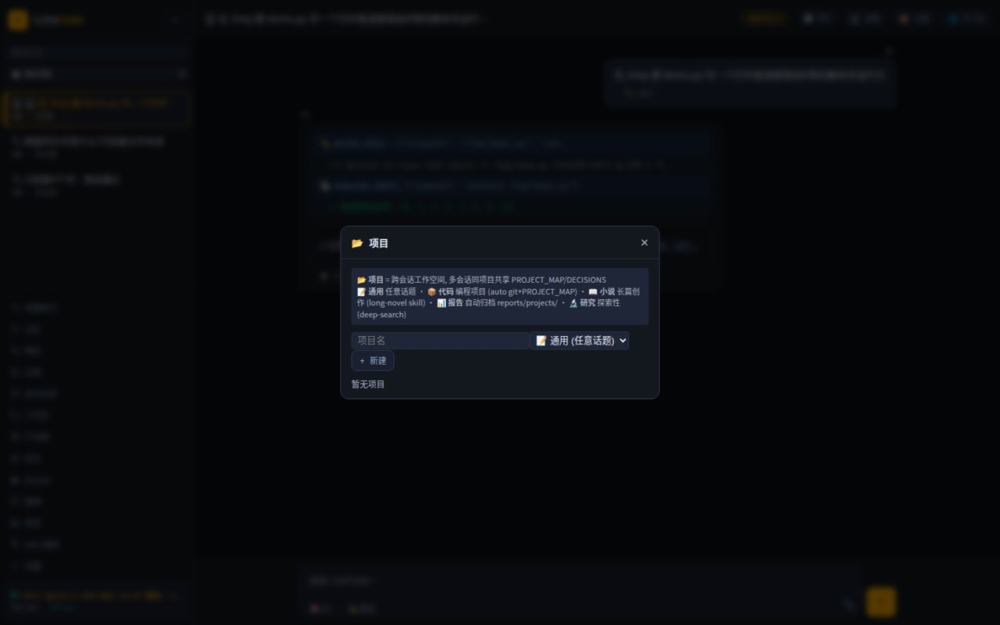
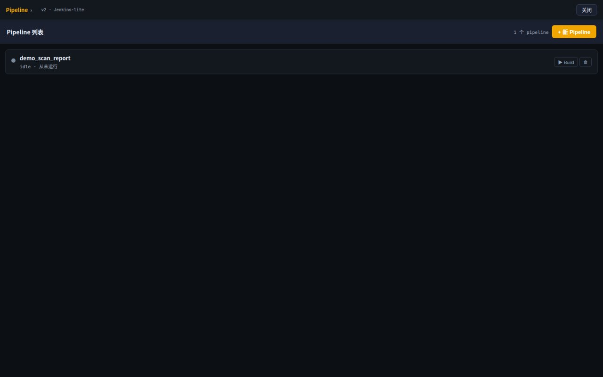

<div align="center">

# ⚔️ LiteCode

### The sharpest self-hosted AI arsenal — one deploy, three fronts.

**English** · [中文](README.zh.md)

*Turn one machine of your own into a full-time AI engineering team: a Web command center, a hands-on CLI, and WeChat / WeCom bots in your pocket — all running in your container, on your models, with your data never leaving home.*

`OpenAI-compatible` · `Multi-model` · `Multi-modal` · `DAG multi-agent` · `Self-hosted` · `Private`


⭐ **If this saves you a weekend of glue code, star it — that's the whole fuel tank.**

</div>

---

## Why LiteCode

- 🏠 **Fully private.** Gateway (OpenAI-compatible SSE) + Web + CLI + bots all live in a single Docker container. Point it at your own vLLM or any OpenAI-compatible endpoint. Keys, sessions, memory, and artifacts stay on your disk.
- 🧩 **A chassis, not a monolith.** Drop in a `plugin.py` to extend; pull an env var to unplug. External projects mount in with zero copy, zero intrusion.
- 🏗️ **AI-flavored Jenkins.** Pipeline / Job / Build-History / Artifact / breakpoint / resume — the mental model is Jenkins. AI only adds three things: turn plain language into a pipeline, thread parameters, and summarize.
- 📱 **Chat is the entry point.** Scan a QR to plug your personal WeChat in; send a screenshot, drop a PDF, say a word — it's the same agent loop underneath. WeCom (Enterprise WeChat) gets true streaming replies.
- ⚡ **One box, maximum output.** A single-machine personal-productivity powerhouse — a no-nonsense, brute-efficiency AI machine built to just get things done, fast.

---

## How it's different

Not another framework or another chat frontend — LiteCode is the **whole box**: gateway + Web + CLI + chat bots + orchestration, self-hosted, on your models.

| | **LiteCode** | Dify | LangChain | Open WebUI |
|---|:---:|:---:|:---:|:---:|
| Single self-hosted container | ✅ | ✅ | library | ✅ |
| OpenAI-compatible gateway | ✅ | partial | — | chat only |
| One agent brain across **Web + CLI + chat bots** | ✅ | Web | code | Web |
| **WeChat / WeCom (Enterprise) bots** built in | ✅ | — | — | — |
| Visual **DAG multi-agent** (Jenkins-style) | ✅ | flows | code | — |
| Plugin chassis for **image / video / music gen** | ✅ | tools | tools | — |
| **Talk-to-control desktop** (noVNC) | ✅ | — | — | — |
| Four-tier persistent memory | ✅ | partial | — | basic |

_Rough positioning, not a scorecard — every tool above is great at what it's for. LiteCode's bet is "one private box that does all of it."_

---

## Built lean, on purpose

Agent frameworks love to sprawl — a mesh of services to babysit, a maze of permissions to fight, and behavior you can't actually see. LiteCode deliberately goes the other way:

- **One container, not a service mesh.** Host-network, `./start.sh`, done. Nothing to orchestrate but your agents — no bloat, no ceremony.
- **Permissions that stay out of your way.** Bearer token for the gateway, cookie for the Web UI, per-IP rate limiting, owner-scoped artifacts, and lightweight guard rails (loop protection, read-only / plan gates). Legible and minimal — not a heavyweight RBAC you fight for a week.
- **No black boxes.** Tracing, guard-injection stats, and an execution-record timeline mean you can always see exactly what the agent did and why.

---

## Feature Tour

### 🔌 Model compatibility — bring any model, any modality
- **OpenAI-compatible `/v1/chat/completions`** with SSE streaming. Works with LangChain / OpenAI SDK / Dify / Open WebUI out of the box.
- **Five backend stacks** behind one transport: `vllm` · `openai` · `anthropic` · `ollama` · `deepseek`. Adding a same-protocol model is pure config.
- **Hot model switch** at runtime (`/api/models/switch`), per-message model / thinking-effort override in the Web UI, and a thinking-parameter adapter that papers over each stack's quirks.
- **Multi-modal & multi-model**: text, vision, and generation all in one loop. Point images at any vision-capable model (e.g. Qwen-VL), with a configurable vision fallback.

### 🎨 Generative plugins — the chassis stays open
The plugin architecture is a **core, preserved design principle**: every generative capability slots in as a self-contained file, nothing in the core changes.
- **Image generation — built in**: `image_gen` with four providers out of the box (DALL·E 3 · Stable-Diffusion WebUI · ComfyUI · mock). Same-protocol services are pure config; a new protocol is a ~40-line adapter.
- **Video / music / any-modality generation — drop-in**: add one `plugins/tools/*.py` (mirror the image-gen skeleton: dispatch → submit-task → poll → fetch → emit artifact), declare it in config, and the registry auto-discovers it. **No touching the registry, contract, core, or DAG.** That's the whole point of the chassis.
- Whatever you plug in becomes a **first-class tool** the agent can call and a **DAG step** you can orchestrate.

### 🔍 Multi-layer search — never blocked
Search is **layered**, so one blocked engine never stops you:
- **Free search APIs** first — fast, no browser.
- **A local SearXNG sidecar** aggregating many engines behind a private JSON gateway — no rate-limit walls, no CAPTCHAs.
- **Multi-engine HTML in parallel** (7 domestic + 7 international engines) when the APIs fall short.
- **A real Playwright browser** (single-instance, closes when done) as the last resort — for pages that only render with JS.
- **`deep_search`** ties the tiers together: run them, click into the top results, and read the actual article text (configurable depth).

### 🖥️ Command-line CLI — three ends, one brain
The terminal is a first-class front end, not an afterthought. `cli.py` is an interactive REPL straight onto the gateway (streaming, foldable thinking, two-stage `Ctrl-C` interrupt, live tool-call rendering); `litecli.py` is a thin REST client with a full command surface — `chat · dag · model · sessions · memory · timer · wechat · wecom · docker · plugins · projects · stats · ws · config · repl`, plus REPL slash-commands (`/think /interrupt /dag /memory /checkpoints /model …`). `--output-format stream-json` makes it CI-friendly.

### 🤖 WeChat & WeCom intelligent bots
- **Personal WeChat**: QR login + keep-alive; ingests images, voice (Whisper fallback), files, video, and quoted messages — attachments buffer until your instruction lands.
- **WeCom (Enterprise WeChat) smart robot**: true streaming replies, image + file + markdown out, media chunked-upload with 3-day cache.
- Same agent brain as Web and CLI — one loop, three faces.

### 🏗️ DAG multi-agent orchestration (AI-Jenkins)
- Topological scheduling + same-layer parallelism + Critic re-runs + checkpoint restore + failure self-reflection retries.
- Node types: agent-step / native-tool-step / **sub-DAG** / **decision node (2 outlets)**; inter-step conditions (`when`) and `${step:id:json:path}` value passing.
- **Natural-language DAG**: generate / edit / delete / schedule a whole pipeline by talking to it.
- Visual drawflow editor in the Web UI, with a live Build view (running step, heartbeat, execution-record timeline).

### ⏰ Scheduled tasks
- Cron & one-shot timers with a visual editor, run-history, and notifications.
- Fire a shell command, a prompt, or a whole DAG on a schedule.

### 🧠 Four-tier memory (L0–L3)
- Sliding window → always-on `MEMORY.md` → typed `memory/*.md` → SQLite FTS5 full-text recall across sessions.
- Rule-based preference capture writes memory automatically (secrets auto-redacted) — no reliance on the model remembering to call a tool.

### 🖥️ Talk-to-control desktop
- `desktop_exec` / `screenshot` / `key` / `type` / `click` drive a real browser/GUI on a noVNC desktop, screenshots rendered back into chat.

### 📊 Observability & engineering discipline
- Iteration tracing, tool / subagent / DAG telemetry, guard-injection stats, token accounting, and an execution-record timeline.
- A discipline of **making silent failures visible** and **counting every guard injection** keeps the agent's behavior explainable — not a black box.

---

## Quick Start

```bash
git clone <your-fork-url> litecode && cd litecode
cp config.example.json config.json     # fill in your model endpoint + key
./start.sh                             # auto-detects, builds if needed
```

| Port | Purpose | Auth |
|---|---|---|
| `:18789` | Gateway API (OpenAI-compatible) | Bearer token |
| `:18790` | Web UI + CLI backend | Cookie password |
| `:18800` | noVNC remote desktop | — |

> Everything is bind-mounted — edit code, `docker restart`, done. Single-file mounts need a `docker restart` to re-establish (inode trap).

**Talk to it like any OpenAI endpoint:**

```python
from openai import OpenAI
client = OpenAI(base_url="http://127.0.0.1:18789/v1", api_key="YOUR_TOKEN")
r = client.chat.completions.create(
    model="your-model", stream=True, user="my_session",
    messages=[{"role": "user", "content": "Scan this repo and write a report"}],
)
for c in r:
    print(c.choices[0].delta.content or "", end="", flush=True)
```

---

## Screenshots

**DAG editor — AI-flavored Jenkins.** Drag agent / tool nodes (coder · analyst · vision · `pptx_render` · `image_gen` · decision · sub-DAG …), wire them up, hit **Build**.


**CLI — the terminal is a first-class front end.** One prompt → it writes files, shows diffs, runs shell, reports token usage.


<details>
<summary><b>▸ More screenshots — WeChat / WeCom bots · memory · models · timers · artifacts · Docker · projects · CLI commands</b> (click to expand)</summary>

| WeChat integration | WeCom (Enterprise) bot | Four-tier memory |
|:---:|:---:|:---:|
|  |  |  |
| **Model management** | **Scheduled tasks** | **Artifacts** |
|  |  |  |
| **Usage & cost** | **Docker control** | **Projects** |
|  |  |  |
| **Pipeline list** | **CLI commands** | |
|  |  | |

</details>

---

## Architecture

```
   WeChat / WeCom bots ┐
   CLI (REPL)          ├──▶  Gateway :18789  (OpenAI-compatible SSE, the agent loop)
   Browser ────────────┘            ▲
                                    │ same-origin proxy
                        Web UI :18790  (DAG · timers · memory · model/plugin/container admin)
```

Not three equal implementations — **Web is the full hub, CLI is a (catching-up) subset, WeChat/WeCom are pure chat bots.** The one thing all three share is the conversation. Deep dive: [`docs/ARCHITECTURE.md`](docs/ARCHITECTURE.md).

---

## Star this repo ⭐

LiteCode is built in the open by one small team. If it's useful, a star is the single most helpful thing you can do — it's how others find it. Watch + Star, and tell us what you'd build.

## License

MIT
